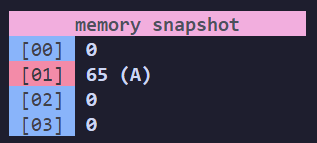

# Cerebrum Fornicate

An **overengineered** [Brainfuck](https://en.wikipedia.org/wiki/Brainfuck) interpreter that can do everything every other brainfuck interpreters can but also a little more.

## Core Features
- [x] Full Brainfuck Interpreter
- [x] Interpret by File
- [x] Interpret by Cmd Args

### Commands
`>` *increment* the data **pointer**  
`<` *decrement* the data **pointer**  
`+` *increment* the **byte** at the data pointer  
`-` *decrement* the **byte** at the data pointer  
`.` *output* the **byte** at the data pointer  
`,` accept one **byte** of *input*  
`[` *jump forward* past the **matching *]*** if the byte at the pointer is **0**  
`]` *jump back* to the **matching *[*** if the byte at the pointer is **nonzero**  
`#` print **debug information**  
`@` print a **memory snapshot**  

### Extra Features
This is an **overengineered** interpreter so it has things you don't need but are cool enough to make me spend 5h on the project.

#### Debug Information

    

At anypoint you wish, add a **#** in the middle of your script and the interpreter will spew out data at you.

#### Memory Snapshots

    

Like the debug, except putting **@** will spew out a snapshot of the current memory address at your pointer and ones around it in a table.

You can customise how much of the memory you see with the `-snapx` and `-snapy` flags. Each representing the amount of addresses above and below the pointer address.

You can also use the `-memory` flag to set the exact size of the memory array by bytes.

#### Images and Colors

    

The interpreter can spew out colors to the terminal.  
Depending on the number in the current address the interpreter will spew out a 2 character wide square.

`>32`:   Black  
`>64`:   Red  
`>96`:   Green  
`>128`:  Yellow  
`>160`:  Blue  
`>192`:  Magenta  
`>224`:  Cyan  
default: White  

The size at which the image wraps can be customised with `-w` flag. It's 16 by default