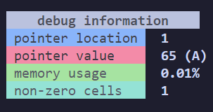

# Cerebrum Fornicate

An **overengineered** [Brainfuck](https://en.wikipedia.org/wiki/Brainfuck) interpreter that can do everything every other brainfuck interpreter can but also a little more.

## Core Features
- [x] Full Brainfuck Interpreter
- [x] Interpret by File
- [x] Interpret by Cmd Args

### Commands
`>` *increment* the data **pointer**
`<` *decrement* the data **pointer**
`+` *increment* the **byte** at the data pointer
`-` *decrement* the **byte** at the data pointer
`.` *output* the **byte** at the data pointer
`,` accept one **byte** of *input*
`[` *jump forward* past the **matching *]*** if the byte at the pointer is **0**
`]` *jump back* to the **matching *[*** if the byte at the pointer is **nonzero**
`#` print **debug information**
`@` print a **memory snapshot**

### Extra Features
This is an **overengineered** interpreter so it has things you don't need but are cool enough to make me spend 3h on the project.

#### Debug Information

    

At anypoint you wish, add a **#** in the middle of your script and the interpreter will spew out data at you.

#### Memory Snapshots

    

Like the debug, except putting **@** will spew out a snapshot of the current memory address at your pointer and ones around it in a table.

You can customise how much of the memory you see with the `-snapx` and `-snapy` flags. Each representing the amount of addresses above and below the pointer address.

#### Images and Colors

    

The interpreter can spew out colors to the terminal.
Depending on the number in the current address the interpreter will spew out a 2 character wide square.

`>32`: Black
`>64`: Red
`>96`: Green
`>128`: Yellow
`>160`: Blue
`>192`: Magenta
`>224`: Cyan
default: White

The size at which the image wraps can be customised with `-w` flag. It's 16 by default